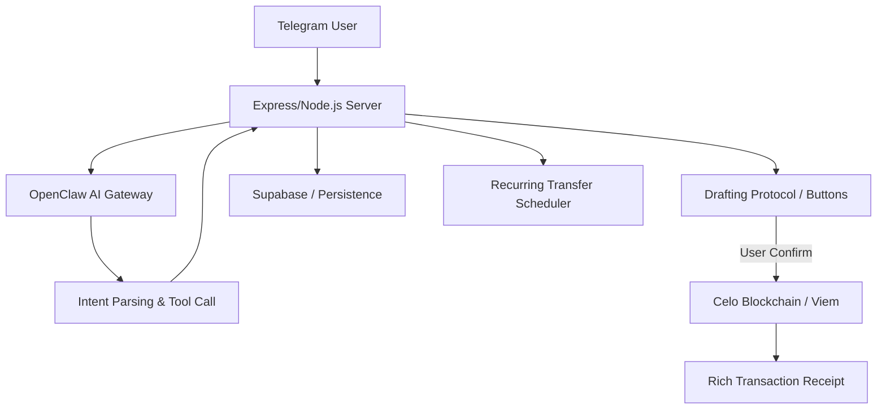

# FX RemitBot: High-Trust AI Remittances

FX RemitBot is a professional-grade AI financial assistant for Telegram and WhatsApp, built on the Celo blockchain. It empowers users to send money globally using natural language while maintaining the highest levels of safety through the innovative Drafting Protocol.

## The Drafting Protocol

Unlike traditional bots that execute transactions automatically, RemitBot acts as a Senior Drafting Assistant. This architecture ensures that the AI can never move funds without explicit human consent.

- **Intent Parsing**: The AI understands natural language requests like "Remit $50 to Kenya."
- **Drafting**: The AI proposes a transaction but cannot execute it.
- **Interactive Confirmation**: A secure inline keyboard allows the user to Confirm or Cancel before any funds move.

### Technical Flow



## Features

- **Natural Language Intent Parsing**: AI-led handling for transfers, schedules, and balance checks.
- **Smart Contact Lookup**: "Send to Mama" automatically resolves to saved addresses via database lookup.
- **Recurring Transfers**: Sophisticated cron-based scheduler with interactive drafting and secure UUID resolution.
- **Multi-Currency Support**: Native support for CELO, cUSD, cEUR, cKES, cNGN, and more via Mento Protocol.
- **Cloud Resilience**: Optimized for deployment on services like Render with dynamic port handling and AI gateway timeouts.
- **Premium UX**: Native Telegram menus, rich receipts, and human-readable error messages.

## User Commands

The bot supports the following native Telegram commands:

- **/start**: Launches the main interactive dashboard.
- **/balance**: Checks all stablecoin and native asset balances in your agent wallet.
- **/contacts**: Manages your registered beneficiaries and their Celo addresses.
- **/reset**: Clears the current AI session context (with confirmation).
- **/help**: Provides detailed transfer examples and instructions.

## Quick Start

### 1. Prerequisites

- Node.js v18+
- A Celo wallet with small amount of CELO/cUSD for testing.
- A Supabase project (Schema provided in src/db/schema.sql).
- An OpenClaw Gateway token.

### 2. Environment Setup

```bash
git clone https://github.com/Kanasjnr/fx-remitBot.git
cd fx-remitBot
npm install
cp .env.example .env
```

### 3. Environment Variables

| Variable | Description |
| :--- | :--- |
| `TELEGRAM_BOT_TOKEN` | Your Telegram Bot API token from BotFather. |
| `SUPABASE_URL` | Your Supabase project URL. |
| `SUPABASE_KEY` | Your Supabase anon/service key. |
| `AGENT_PRIVATE_KEY` | The private key for the on-chain agent wallet. |
| `CELO_RPC_URL` | RPC endpoint (Default: https://forno.celo.org). |
| `OPENCLAW_GATEWAY_TOKEN` | Token for the OpenClaw Agent Gateway. |
| `OPENCLAW_GATEWAY_URL` | URL for the AI Gateway (Ngrok URL if local). |
| `BACKEND_URL` | Public URL of this server (Ngrok or Render). |
| `PORT` | Local server port (Default: 3000). |

## Cloud Deployment (Render)

1. **Build Command**: `npm install && npm run build`
2. **Start Command**: `npm start`
3. **Environment Variables**: Add the variables listed above to the Render dashboard.
4. **AI Gateway Bridge**: If running the OpenClaw gateway locally, use ngrok to expose it:
   ```bash
   ngrok http 18789
   ```
   Update `OPENCLAW_GATEWAY_URL` in Render whenever the ngrok URL changes.

## Tech Stack

- **Blockchain**: Celo (Viem, Mento Protocol)
- **AI**: OpenClaw Gateway (Agentic Intelligence)
- **Backend**: Node.js, Express, TypeScript
- **Database**: Supabase (PostgreSQL)
- **Interface**: node-telegram-bot-api
- **Scheduling**: node-cron
