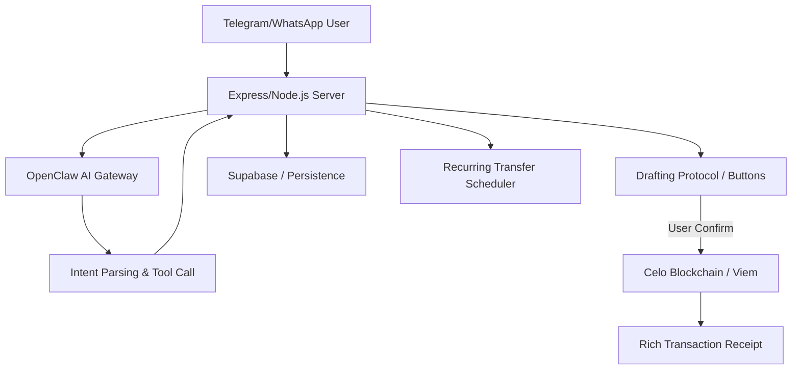

# 🏛️ FX RemitBot: High-Trust AI Remittances

**RemitBot** is a professional-grade AI financial assistant for Telegram and WhatsApp, built on the Celo blockchain. It empowers users to send money globally using natural language while maintaining the highest levels of safety through our innovative **Drafting Protocol**.

## 🚀 Key Innovation: The Drafting Protocol
Unlike traditional bots that execute transactions automatically, RemitBot acts as a "Senior Drafting Assistant."
- **Intent Parsing**: The AI understands "Remit $50 to Mama."
- **Drafting**: The AI proposes a transaction but **cannot** execute it.
- **Interactive Confirmation**: A secure inline keyboard allows the user to **✅ Confirm** or **❌ Cancel** before any funds move.

---

## 🏗️ Architecture



---

## 🛠️ Features
- **Natural Language Handling**: AI-led intent parsing for transfers, schedules, and balance checks.
- **Smart Contact Lookup**: "Send to Mama" automatically resolves to saved addresses.
- **Recurring Transfers**: Sophisticated cron-based scheduler with interactive drafting.
- **Multi-Currency**: Support for CELO, cUSD, cEUR, cKES, cNGN, and more.
- **Premium UX**: Native Telegram menus, rich receipts, and human-readable error messages.

---

## ⚙️ Quick Start

### 1. Prerequisites
- Node.js v18+
- A Celo wallet with small amount of CELO/cUSD for testing.
- A Supabase project (Schema provided in `src/db/schema.sql`).
- An OpenClaw Gateway token.

### 2. Setup
```bash
git clone https://github.com/Kanasjnr/fx-remitBot.git
cd fx-remitBot
npm install
cp .env.example .env
```
*Fill in your `.env` with your API keys and Celo private key.*

### 3. Run
```bash
npm run dev
# In a separate terminal, use ngrok to expose port 3000
ngrok http 3000
```
*Set your `BACKEND_URL` in `.env` to your ngrok URL.*

---

## 🛠️ Tech Stack
- **Blockchain**: Celo (Viem, Mento Protocol)
- **AI**: OpenClaw Gateway (Agentic Intelligence)
- **Framework**: Node.js, Express, TypeScript
- **Database**: Supabase (PostgreSQL)
- **Interface**: node-telegram-bot-api
